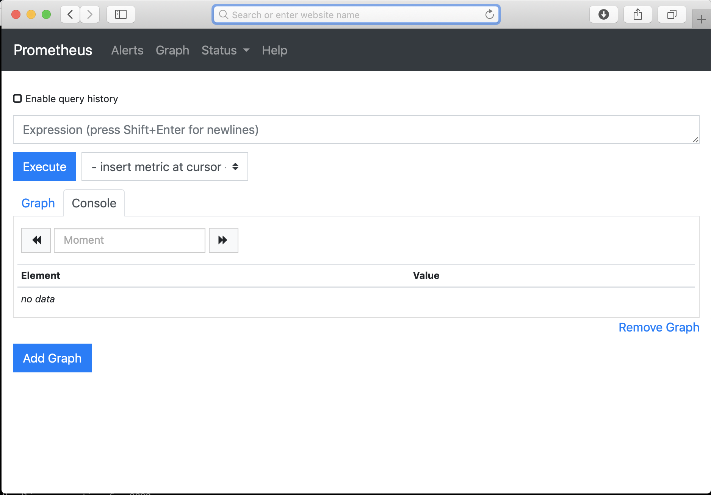

# Data Source Setup

I need a bit of sample-data source to make this project effective. One of the end goals I'd hoped to enable was to visualize
data from running cloud-hosted systems, so this provides a local starting point for the same.

This example leverages Kubernetes, Minikube, and Prometheus to set up a small and simple instance of Prometheus
monitoring data of the minikube cluster.

## pre-req install and setup

(assumes you have Homebrew installed)

    brew install kubectl
    brew cask install minikube
    
    brew install hyperkit
    minikube config set vm-driver hyperkit

    brew install kubernetes-helm
    
## start and run minikube

    minikube start
    minikube addons enable ingress
    minikube addons disable heapster
    minikube addons enable metrics-server
    
You'll likely see output akin to:

    😄  minikube v1.0.0 on darwin (amd64)
    🤹  Downloading Kubernetes v1.14.0 images in the background ...
    🔥  Creating hyperkit VM (CPUs=2, Memory=2048MB, Disk=20000MB) ...
    📶  "minikube" IP address is 192.168.64.38
    🐳  Configuring Docker as the container runtime ...
    🐳  Version of container runtime is 18.06.2-ce
    ⌛  Waiting for image downloads to complete ...
    ✨  Preparing Kubernetes environment ...
    🚜  Pulling images required by Kubernetes v1.14.0 ...
    🚀  Launching Kubernetes v1.14.0 using kubeadm ...
    ⌛  Waiting for pods: apiserver proxy etcd scheduler controller dns
    🔑  Configuring cluster permissions ...
    🤔  Verifying component health .....
    💗  kubectl is now configured to use "minikube"
    🏄  Done! Thank you for using minikube!
    
    
## verify minikube is up and running

`minikube status`:

    host: Running
    kubelet: Running
    apiserver: Running
    kubectl: Correctly Configured: pointing to minikube-vm at 192.168.64.38

`kubectl get pods --all-namespaces`:

    NAMESPACE     NAME                                        READY   STATUS    RESTARTS   AGE
    kube-system   coredns-fb8b8dccf-hf9tj                     1/1     Running   1          3m57s
    kube-system   coredns-fb8b8dccf-kv6pc                     1/1     Running   1          3m57s
    kube-system   default-http-backend-6864bbb7db-tp7m7       1/1     Running   0          3m56s
    kube-system   etcd-minikube                               1/1     Running   0          2m41s
    kube-system   heapster-89prj                              1/1     Running   0          3m56s
    kube-system   influxdb-grafana-ljm2z                      2/2     Running   0          3m56s
    kube-system   kube-addon-manager-minikube                 1/1     Running   0          2m55s
    kube-system   kube-apiserver-minikube                     1/1     Running   0          2m44s
    kube-system   kube-controller-manager-minikube            1/1     Running   0          2m56s
    kube-system   kube-proxy-8vqvq                            1/1     Running   0          3m57s
    kube-system   kube-scheduler-minikube                     1/1     Running   0          3m4s
    kube-system   nginx-ingress-controller-586cdc477c-dpw8k   1/1     Running   0          3m55s
    kube-system   storage-provisioner                         1/1     Running   0          3m54s

## install and set up Helm

    helm init
    helm repo update
    
## install prometheus using Helm

    helm install stable/prometheus -n monitor --namespace monitoring

see the pods that make up this installation:

`kubectl get pods -n monitoring`:

    NAME                                                     READY   STATUS    RESTARTS   AGE
    monitor-prometheus-alertmanager-684b68ddc6-bxgqq         2/2     Running   0          5m23s
    monitor-prometheus-kube-state-metrics-5d9c7fcd84-jdk5c   1/1     Running   0          5m23s
    monitor-prometheus-node-exporter-7t4mp                   1/1     Running   0          5m23s
    monitor-prometheus-pushgateway-5f46cbb5cf-bdrdt          1/1     Running   0          5m23s
    monitor-prometheus-server-5fc4c56c4f-mj67m               2/2     Running   0          5m23s

You can get the current status and notes from the installation using the command `helm status monitor`:

    LAST DEPLOYED: Tue Apr 23 09:13:36 2019
    NAMESPACE: monitoring
    STATUS: DEPLOYED

    RESOURCES:
    ==> v1/ConfigMap
    NAME                             DATA  AGE
    monitor-prometheus-alertmanager  1     6m12s
    monitor-prometheus-server        3     6m12s

    ==> v1/PersistentVolumeClaim
    NAME                             STATUS  VOLUME                                    CAPACITY  ACCESS MODES  STORAGECLASS  AGE
    monitor-prometheus-alertmanager  Bound   pvc-bffdbf1f-65e2-11e9-9137-ce327a1502b5  2Gi       RWO           standard      6m12s
    monitor-prometheus-server        Bound   pvc-c0006553-65e2-11e9-9137-ce327a1502b5  8Gi       RWO           standard      6m12s

    ==> v1/Pod(related)
    NAME                                                    READY  STATUS   RESTARTS  AGE
    monitor-prometheus-alertmanager-684b68ddc6-bxgqq        2/2    Running  0         6m11s
    monitor-prometheus-kube-state-metrics-5d9c7fcd84-jdk5c  1/1    Running  0         6m11s
    monitor-prometheus-node-exporter-7t4mp                  1/1    Running  0         6m11s
    monitor-prometheus-pushgateway-5f46cbb5cf-bdrdt         1/1    Running  0         6m11s
    monitor-prometheus-server-5fc4c56c4f-mj67m              2/2    Running  0         6m11s

    ==> v1/Service
    NAME                                   TYPE       CLUSTER-IP      EXTERNAL-IP  PORT(S)   AGE
    monitor-prometheus-alertmanager        ClusterIP  10.102.237.151  <none>       80/TCP    6m11s
    monitor-prometheus-kube-state-metrics  ClusterIP  None            <none>       80/TCP    6m11s
    monitor-prometheus-node-exporter       ClusterIP  None            <none>       9100/TCP  6m11s
    monitor-prometheus-pushgateway         ClusterIP  10.101.191.133  <none>       9091/TCP  6m11s
    monitor-prometheus-server              ClusterIP  10.107.57.15    <none>       80/TCP    6m11s

    ==> v1/ServiceAccount
    NAME                                   SECRETS  AGE
    monitor-prometheus-alertmanager        1        6m12s
    monitor-prometheus-kube-state-metrics  1        6m11s
    monitor-prometheus-node-exporter       1        6m11s
    monitor-prometheus-pushgateway         1        6m11s
    monitor-prometheus-server              1        6m11s

    ==> v1beta1/ClusterRole
    NAME                                   AGE
    monitor-prometheus-kube-state-metrics  6m11s
    monitor-prometheus-server              6m11s

    ==> v1beta1/ClusterRoleBinding
    NAME                                   AGE
    monitor-prometheus-kube-state-metrics  6m11s
    monitor-prometheus-server              6m11s

    ==> v1beta1/DaemonSet
    NAME                              DESIRED  CURRENT  READY  UP-TO-DATE  AVAILABLE  NODE SELECTOR  AGE
    monitor-prometheus-node-exporter  1        1        1      1           1          <none>         6m11s

    ==> v1beta1/Deployment
    NAME                                   READY  UP-TO-DATE  AVAILABLE  AGE
    monitor-prometheus-alertmanager        1/1    1           1          6m11s
    monitor-prometheus-kube-state-metrics  1/1    1           1          6m11s
    monitor-prometheus-pushgateway         1/1    1           1          6m11s
    monitor-prometheus-server              1/1    1           1          6m11s

    NOTES:
    The Prometheus server can be accessed via port 80 on the following DNS name from within your cluster:
    monitor-prometheus-server.monitoring.svc.cluster.local

    Get the Prometheus server URL by running these commands in the same shell:
    export POD_NAME=$(kubectl get pods --namespace monitoring -l "app=prometheus,component=server" -o jsonpath="{.items[0].metadata.name}")
    kubectl --namespace monitoring port-forward $POD_NAME 9090

    The Prometheus alertmanager can be accessed via port 80 on the following DNS name from within your cluster:
    monitor-prometheus-alertmanager.monitoring.svc.cluster.local

    Get the Alertmanager URL by running these commands in the same shell:
    export POD_NAME=$(kubectl get pods --namespace monitoring -l "app=prometheus,component=alertmanager" -o jsonpath="{.items[0].metadata.name}")
    kubectl --namespace monitoring port-forward $POD_NAME 9093

    The Prometheus PushGateway can be accessed via port 9091 on the following DNS name from within your cluster:
    monitor-prometheus-pushgateway.monitoring.svc.cluster.local

    Get the PushGateway URL by running these commands in the same shell:
    export POD_NAME=$(kubectl get pods --namespace monitoring -l "app=prometheus,component=pushgateway" -o jsonpath="{.items[0].metadata.name}")
    kubectl --namespace monitoring port-forward $POD_NAME 9091

    For more information on running Prometheus, visit:
    https://prometheus.io/

## Connecting to prometheus

The `helm status monitor` command provided details about how to create a proxy server to provide you with access from your 
local machine to the prometheus instance. 

Open a new terminal window and run these commands:

    export POD_NAME=$(kubectl get pods --namespace monitoring -l "app=prometheus,component=server" -o jsonpath="{.items[0].metadata.name}")
    kubectl --namespace monitoring port-forward $POD_NAME 9090

NOTE: this process take over that terminal window (or tab) since it's a long running process. While it's running, you'll see output into the
terminal window when connections are made through this proxy:

    Forwarding from 127.0.0.1:9090 -> 9090
    Forwarding from [::1]:9090 -> 9090
    Handling connection for 9090

Once this is running, you can open a browser to http://localhost:9090/

    open http://localhost:9090

